# Целевая архитектура «Будущего 2.0»

Предварительная версия / MVP архитектурного решения на горизонт 36 месяцев. Предлагаемая модель требует согласования с владельцами доменов и информационной безопасностью. TODO: подтвердить допущения о нагрузке, сроках и восстановлении до реализации.

## Документы и реализация

- [Описание архитектуры, миграции и ограничений](architecture.md).
- C4, контейнеры платформы данных: [исходник Mermaid](c4-containers.mmd), [изображение](c4-containers.svg).
- C4, компоненты API портала: [исходник](c4-components.mmd), [изображение](c4-components.svg).
- [Карта рисков](risk-map.md).
- [План управления рисками](risk-management.md).

## Чтение схем

Область C4 L2 — единая платформа данных и самообслуживания; клинические, банковские и другие доменные системы показаны как внешние к этой платформе программные системы. L3 раскрывает один контейнер, API портала. Это модель C4 в графической нотации Mermaid: контейнер означает приложение или хранилище, а не обязательно Docker-контейнер. Технологии указаны в узлах, протоколы и назначение — на связях.





TODO: обсудить схемы с владельцами клиник, банка, ИИ и корпоративных сервисов; получить подтверждение запрещённых для аналитики полей и целевых показателей. Диаграммы отражают проект, а не уже развёрнутую инфраструктуру.

## Воспроизведение схем

Экспорты получены Mermaid CLI 11.4.2. После установки CLI и доступного Chromium выполнить из корня репозитория:

```bash
mmdc -i Task3Advanced/c4-containers.mmd -o Task3Advanced/c4-containers.svg -c Task3Advanced/mermaid-config.json -b white
mmdc -i Task3Advanced/c4-components.mmd -o Task3Advanced/c4-components.svg -c Task3Advanced/mermaid-config.json -b white
```
