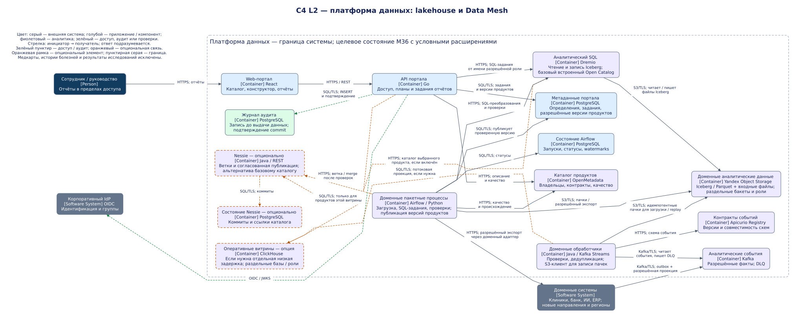
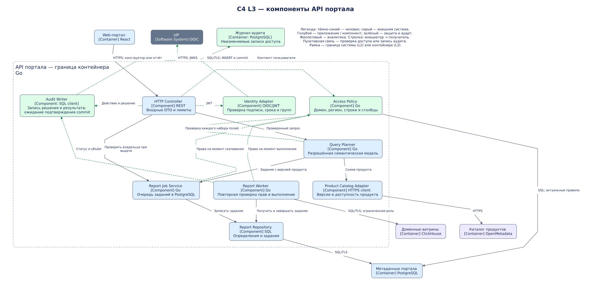
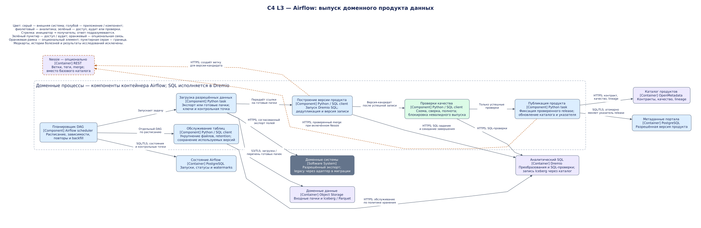

# Целевая архитектура «Будущего 2.0»

Проект архитектуры на горизонт 36 месяцев: доменные продукты данных, платформа самообслуживания и постепенный вывод общей бизнес-логики из DWH.

## Документы и реализация

- [Описание архитектуры, миграции и ограничений](architecture.md).
- C4 L2, контейнеры платформы: [редактируемая диаграмма drawio](c4-containers.drawio), [SVG](diagrams/c4-containers.svg).
- C4 L3, компоненты API портала: [редактируемая диаграмма drawio](c4-components.drawio), [SVG](diagrams/c4-components.svg).
- C4 L3, компоненты доменных процессов Airflow: [редактируемая диаграмма drawio](c4-pipeline-components.drawio), [SVG](diagrams/c4-pipeline-components.svg).
- [Карта рисков](risk-map.md).
- [План управления рисками](risk-management.md).

## Чтение схем

Тёмно-синий обозначает человека, серый — внешнюю систему, голубой — приложение или компонент, зелёный — защиту и аудит, фиолетовый — аналитику. Стрелка направлена от инициатора к получателю. Зелёные пунктирные связи обозначают проверки доступа и запись аудита. Оранжевые пунктирные рамки и связи — условные расширения: Nessie и ClickHouse. Серая пунктирная рамка — граница системы на L2 или контейнера на L3.

Базовое решение: Yandex Object Storage, таблицы Apache Iceberg, Dremio со встроенным Open Catalog и доменные процессы Airflow. Iceberg — формат таблиц, поэтому отдельного исполняемого контейнера на схеме нет. Nessie заменяет базовый каталог для выбранных продуктов, если нужна публикация через ветки; одна таблица не регистрируется одновременно в двух каталогах. ClickHouse включается при подтверждённой потребности в отдельной оперативной витрине.

Диаграммы описывают целевое состояние и условные расширения. Контейнеры доменных обработчиков и процессы Airflow показаны типовыми экземплярами: команды владеют своим кодом, контрактами и продуктами, платформа — общими сервисами. Базы PostgreSQL на схемах логически раздельны, с отдельными ролями; отдельный сервер для каждой базы не предписан. Развёртывание scheduler/workers Airflow, внутреннее устройство Dremio и техническая телеметрия опущены. L3 Airflow показывает компоненты доменных DAG и планировщик; передача между задачами означает зависимость выполнения, а не синхронный вызов.

Редактируйте `.drawio` в diagrams.net. После изменения экспортируйте соответствующую страницу в SVG в каталог `diagrams/`, сохраняя имена файлов.
