# Домены и событийные интеграции

Предварительная версия / MVP. Модель Domain-Driven Design (DDD) определяет владельцев бизнес-правил и контрактов. TODO: провести сессию Event Storming с представителями доменов, подтвердить инварианты и разрешённые поля до реализации.

## Документы и реализация

- [Границы bounded contexts и отношения](bounded-contexts.md), [схема](bounded-contexts.svg), [Mermaid](bounded-contexts.mmd).
- [Событийные сценарии](event-storming.md), [схема](event-storming.svg), [Mermaid](event-storming.mmd).
- [Агрегаты: ключи, границы, инварианты](aggregates.md).
- [Каталог и минимальные контракты событий](events.md).
- [Обоснование событийного подхода](justification.md).
- Пример исполнимого контракта: [JSON Schema агрегированной загрузки клиники](contracts/clinic-capacity.schema.json), [синтетическое событие](contracts/clinic-capacity.example.json).





## Проверка и экспорт

Схемы экспортируются Mermaid CLI 11.4.2 с [конфигурацией](../Task3Advanced/mermaid-config.json). Из корня проекта:

```bash
mmdc -i Task4Advanced/bounded-contexts.mmd -o Task4Advanced/bounded-contexts.svg -c Task3Advanced/mermaid-config.json -b white
mmdc -i Task4Advanced/event-storming.mmd -o Task4Advanced/event-storming.svg -c Task3Advanced/mermaid-config.json -b white
```

Контракт проверяется валидатором JSON Schema Draft 2020-12 с проверкой `format`. Синтетический пример не содержит данных реальных пациентов. TODO: расширить исполнимые схемы на весь каталог и проверить producers/consumers на стенде; брокер и сервисы здесь не развёрнуты.
