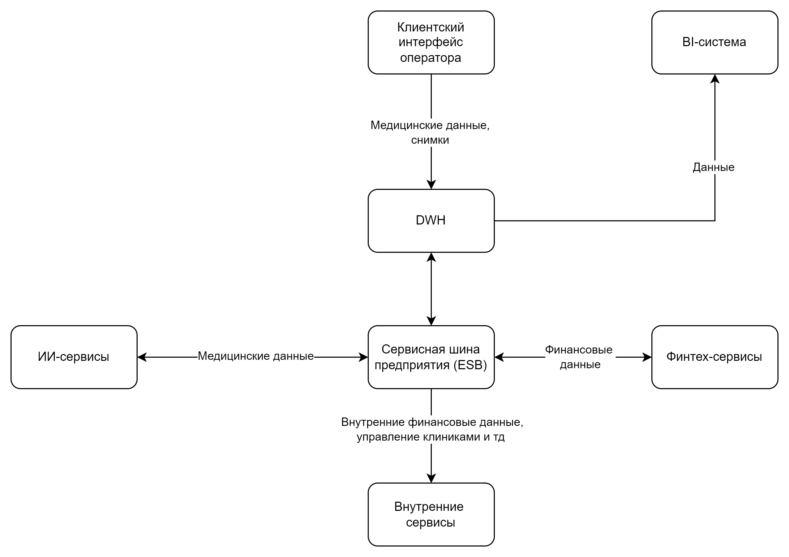

# Описание проектной работы 11 спринта

В этом уроке вы познакомитесь с проектной работой одиннадцатого спринта. Это поможет вам оценить её сложность и распланировать своё время.

> Обратите внимание: вам не нужно выполнять эти задания прямо сейчас. Можете пропустить этот урок и перейти к изучению теории. В конце спринта будет отдельный урок для сдачи проекта: там мы повторим задания и дадим форму, через которую нужно отправить решение.

В этом спринте вы будете работать над кейсом компании «Будущее 2.0».

Компания «Будущее 2.0» начинала как медицинский стартап, а со временем выросла в успешный бизнес. Сегодня её врачи используют современное оборудование и системы искусственного интеллекта для постановки диагнозов и назначения лечения. А недавно компания купила банк, чтобы дополнить свои медицинские услуги финансовыми сервисами. В ближайших планах — интегрировать в экосистему нескольких фармацевтических компаний и производителя электроники для медицинского оборудования.

Изначально все корпоративные данные в «Будущем 2.0» хранились в DWH, построенном на базе SQL Server. В нём была реализована значительная часть бизнес-логики, а для работы операторов в клиниках использовался интерфейс на PowerBuilder.

В DWH лежат:

- Данные по клиентам.
- Медицинские карты и истории болезни, в том числе данные исследований, включая результаты диагностических исследований, проведённых в ходе лечения.
- Финансовая история.
- Счета.
- Данные о кредитах.
- Данные по персоналу больницы.
- Данные по инвентаризации.
- Финансовая отчётность и много другой информации.

«Будущее 2.0» хочет развивать каждое из своих направлений отдельно, сохраняя при этом целостное представление по ключевым бизнес-показателям. Однако уже сейчас построение необходимой отчётности занимает слишком много времени. Объём данных измеряется сотнями терабайт, а сценариев их использования — невероятное множество, что приводит к большому количеству трансформаций. В результате замедляется time-to-market и падает производительность аналитических процессов: формирование сложных отчётов может занимать часы.

В ближайшее время компания «Будущее 2.0» планирует перенести основную часть своего IT-ландшафта в облачную инфраструктуру. Этот шаг позволит быстрее масштабировать ресурсы для работы с данными и гибко подключать новые бизнес-направления, а также сократит затраты на поддержку устаревшего оборудования. В облаке предполагается выстраивать отдельные среды для разных доменов, чтобы обеспечить их независимость и упростить развитие.

Переезд в облако также рассматривается как способ повысить надёжность и доступность сервисов. Для критичных систем будут использоваться механизмы отказоустойчивости, резервного копирования и геораспределённого развёртывания. При этом ключевой задачей останется обеспечение информационной безопасности и соблюдение требований регуляторов, особенно в части работы с медицинскими и финансовыми данными.

## Что нужно сделать

Руководство «Будущего 2.0» поставило перед командой две задачи:

1. **Создать удобную «витрину данных»** — портала самообслуживания, который можно легко масштабировать вне зависимости от количества бизнес-направлений и их целей. Планируется, что сотрудник сможет получить в этой системе отчёт по любым необходимым срезам в пределах своего уровня доступа, а также конструировать собственные отчёты. Важно подчеркнуть, что в «витрину данных» не будут включаться медицинские карты, истории болезней и результаты медицинских исследований. Эти данные компания не предполагает использовать для аналитики.
2. **Предоставить архитектурное решение по изменению IТ-ландшафта в области работы с данными.** Оно должно обеспечить интеграцию новых бизнес-направлений без необходимости вносить значительные объёмы бизнес-логики в DWH.

Бизнес разрешил при необходимости отказаться от легаси-систем и мигрировать на новые сервисы, если вы предоставите весомое обоснование.

### Лендскейп компании

В структуре компании есть четыре подразделения:

- Головной офис;
- Клиники;
- Компания, предоставляющая ИИ-сервисы для работы с медицинскими данными;
- Компания, оказывающая финтех-услуги и обладающая банковской лицензией.

В рамках проектной работы будет необходимо работать с такими продуктами:

- Финтех-сервисами;
- Внутренней медицинской системой (DWH) с клиентским интерфейсом и дополнительной бизнес-логикой под финтех и ИИ-сервисы;
- BI-системой с большим количеством кастомизаций поверх DWH;
- ИИ-сервисами для работы с медицинскими данными;
- Интеграционным слоем через старую шину данных.

Сейчас в «Будущем 2.0» развёрнуты следующие технологии, сервисы и приложения:

- DWH на базе Microsoft SQL-сервера 2008 года;
- Power BI;
- Power Builder;
- ESB на базе Apache Camel;
- ИИ-сервисы на Python;
- Финтех-сервисы на Golang и Java.

Так выглядят потоки данных в компании «Будущего 2.0»:



### Цели бизнеса

**Промежуточное состояние (через пару месяцев)**

- Архитектурное решение по трансформации сформировано и согласовано.
- Границы доменов определены, а ключевые связи между ними описаны.
- В доменах запланированы конкретные проекты по развитию «витрины данных».

**Финальное состояние (через год)**

- Реализован портал самообслуживания.
- Бизнес-пользователи в доменах могут работать с данными в рамках новой архитектуры.
- На этом этапе допускается временное сохранение легаси-систем в отдельных доменах.

**Долгосрочная цель (горизонт три года)**

Компания «Будущее 2.0» планирует масштабироваться по трём направлениям:

- Продукты: запуск новых финтех- и медицинских сервисов, монетизация ИИ-функций.
- География: выход на два-три новых региона с учётом локальных требований.
- Данные: увеличение количества источников и событий, переход от пакетной отчётности («batch») к near-real-time обработке.

А кроме того, целевая архитектура компании должна через три года представлять из себя слабосвязанную событийную платформу, в рамках которой домены взаимодействуют через события и реактивные потоки. Интеграции через шину Camel и DWH используются только как «мосты совместимости» на этапе миграции.

### Этапы трансформации

В «Будущем 2.0» запланированы три этапа трансформации:

1. **Первый этап.** В первые шесть месяцев предполагается внедрить пилот в одном-двух доменах, таких как финансовые расчёты или пациентский поток, с введением единых принципов работы с событиями, очередями DLQ и каталогом схем.
2. **Второй этап.** В следующий период (6–18 месяцы) трансформация расширяется на критические домены, запускаются потоковые витрины, а также вводятся антикоррупционные слои для интеграций через Camel и DWH.
3. **Финальный этап.** В это время (18–36 месяцы) планируется отказ от точечных синхронных интеграций на критическом пути и переход к доменной аналитике на основе потоков данных.

## Как подготовиться к работе

Подготовьте репозиторий, куда вы будете загружать решения заданий:

1. Проект этого спринта вы будете сдавать в Git-репозитории. Создайте публичный репозиторий в GitHub или GitLab. Назовите его «architecture-future_2_0».
2. Проект состоит из пяти заданий. Решение каждого задания нужно будет залить в отдельную директорию. Создайте в репозитории пять директорий и назовите их «Task1Advanced», «Task2Advanced», «Task3Advanced», «Task4Advanced» и «Task5Advanced».
3. Чтобы ревьюеру было проще проверять вашу работу, а вам отслеживать изменения на разных итерациях, загрузите файлы в свой репозиторий и сделайте пул-реквест. На ревью нужно отправить ссылку на пул-реквест.

Если репозиторий готов, можно приступать к заданиям!

## Задание 1. Модульная инфраструктура для нескольких сред

Вам нужно создать универсальный модуль Terraform, который можно использовать для разных окружений (dev, stage, prod).

Реализовать модуль `vm_module` (в папке `modules/vm/`) со следующими параметрами:

- Количество ядер;
- Объём RAM;
- Подключаемый диск;
- Subnet ID;
- SSH-ключ.

Сформировать три окружения, каждое со своей конфигурацией:

- `/envs/dev/`
- `/envs/stage/`
- `/envs/prod/`

В каждом окружении используйте свой `.tfvars`, подставляя разные параметры в модуль.

```text
/TaskAdvanced1/
  ├── modules/
  │   └── vm/
  │       ├── main.tf
  │       ├── variables.tf
  │       └── outputs.tf
  └── envs/
      ├── dev/
      ├── stage/
      └── prod/
```

- `main.tf` — ресурсы ВМ + подключаемый диск + сеть.
- `variables.tf` — входные параметры модуля (см. интерфейс ниже).
- `outputs.tf` — полезные выходы (id ВМ, ip-адрес, имя, id диска и т. д.).
- Внутри модуля не должно быть никаких захардкоженных значений окружений — всё через переменные.
- `README.md` описывает, что делает модуль, параметры, выходы и как его запустить для каждого окружения.

Когда задание будет готово, загрузите переиспользуемый модуль Terraform в директорию **Task1Advanced** в рамках пул-реквеста.

Обратите внимание, что ревьюер будет также смотреть на переиспользуемость модуля в разных окружениях, наличие переменных, правильную структуру, корректный output, читаемость кода и применение окружения с разными конфигурациями через `terraform apply -var-file=...`.

## Задание 2. Интеграция с CI/CD и удалённым хранением состояния

Автоматизируйте развёртывание инфраструктуры через CI/CD, используя удалённое состояние (S3/Minio + backend). Конкретный инструмент для CI/CD не принципиален — вы можете реализовать задачу на Jenkins или в любой другой системе, которая вам ближе и привычнее по опыту.

Для этого:

1. Настройте Terraform-код с backend’ом с использованием S3-совместимого хранилища (minio, Yandex Object Storage, AWS S3).
2. Опишите pipeline с использованием `.gitlab-ci.yml` или GitHub Actions или другого CI/CD-инструмента. Шаги: `terraform init`, `terraform plan`, `terraform apply` (по кнопке или с флагом approval).
3. `README.md` опишет детально все скрипты.

Когда задание будет готово, загрузите Terraform-код с backend’ом в директорию **Task2Advanced** в рамках пул-реквеста.

Обратите внимание, что ревьюер будет оценивать логику CI/CD-пайплайна, включая вопросы безопасности, изоляции и использование переменных, а также проверять, что состояние не хранится локально.

## Задание 3. Проектирование целевой архитектуры и оценка рисков внедрения

1. Спроектируйте целевую архитектуру системы «Будущего 2.0» в горизонте трёх лет, используя C4-модель на уровне контейнеров и компонентов. Покажите, как изменятся ключевые системы компании при масштабировании, включая появление новых бизнес-направлений, интеграцию дополнительных источников данных и отказ от легаси-систем.
2. Составьте карту рисков трансформации, определив архитектурные, организационные и технологические риски. Для каждого риска укажите вероятность его возникновения (низкая, средняя, высокая) и потенциальное влияние на бизнес (низкое, среднее, высокое).
3. Предложите план управления рисками, описав конкретные меры по их снижению. Укажите, какие риски можно минимизировать с помощью технических решений, а какие — управленческими подходами.

Когда задание будет готово, загрузите C4-диаграмму, карту рисков и план управления в директорию **Task3Advanced** в рамках пул-реквеста.

## Задание 4. Моделирование домена и интеграций

1. Разделите систему на домены с использованием подхода Domain-Driven Design (DDD). Определите bounded contexts для каждого домена и опишите ключевые агрегаты и события, которые будут играть важную роль при взаимодействии между доменами.
2. Опишите целевую событийную архитектуру, построив Event Storming-диаграмму или аналогичную схему. На диаграмме отразите основные события, публикуемые доменами. Например: «Создан кредитный договор», «Зарегистрирован новый пациент» или «Пройдено исследование ИИ». Укажите, какие домены выступают источниками этих событий, а какие — подписчиками.
3. Обоснуйте выбор событийного подхода, пояснив, какие преимущества он принесёт компании «Будущее 2.0». Опишите, как переход на интеграцию через события повысит гибкость, масштабируемость и скорость реакции системы по сравнению с текущей шиной Camel и DWH.

Когда задание будет готово, загрузите схему bounded contexts, Event Storming и аргументацию в директорию **Task4Advanced** в рамках пул-реквеста.

Обратите внимание, что в репозитории есть директория `/Task4Advanced/` с артефактами:

- `bounded-contexts.*` — схема bounded contexts (PNG/PDF/MD/PlantUML/Mermaid/Miro export).
- `event-storming.*` — Event Storming (или эквивалентная событийная схема).
- `aggregates.md` — описание агрегатов (границы, инварианты, ключи).
- `events.md` — каталог доменных событий (название, контекст-источник, семантика, минимальный контракт).
- `justification.md` — обоснование событийного подхода vs Camel/DWH.

## Задание 5. Проектирование технологического стека и расчёт стоимости

Спроектируйте технологический ландшафт и выполните стоимостной анализ планируемых изменений.

1. Сформируйте целевой технологический стек, составив расширенный технический радар, который должен включать не только технологии, но и архитектурные паттерны (например, Data Mesh, Event-Driven Architecture, Self-service BI). Для каждой технологии или паттерна укажите её текущий статус: Adopt, Trial, Assess или Hold.
2. Разработайте экономическое обоснование трансформации, описав модель TCO (Total Cost of Ownership) для текущей и целевой архитектуры. Укажите основные статьи затрат, включая инфраструктуру, лицензии, сопровождение, время аналитиков, и сравните их на горизонте трёх лет.
3. Составьте стратегический роадмап внедрения Data Mesh, указав ключевые роли, такие как Data Product Owner, Data Engineer и BI-аналитик. Опишите этапы внедрения, включая пилот, масштабирование и поддержку доменов, и привяжите их к основным бизнес-целям компании.

Когда задание будет готово, загрузите разработанный расширенный техрадар, TCO-анализ и роадмап в директорию **Task5Advanced**.

Обратите внимание, что в репозитории есть директория `/Task5/` с артефактами:

- `tech-radar.*` — расширенный технический радар (таблица, диаграмма или draw.io).
- `tco-analysis.*` — TCO-анализ (таблица или документ).
- `roadmap.*` — стратегический роадмап (диаграмма или таблица).

## Как сдать работу

В начале работы у вас должен быть Git-репозиторий «architecture-future_pro_2_0», в котором есть пять пустых директорий. Чтобы сдать своё решение на проверку, вам нужно сделать пул-реквест, который будет содержать все изменения.

- В директории **Task1Advanced** должен лежать переиспользуемый модуль Terraform.
- В директории **Task2Advanced** должен лежать Terraform-код.
- В директории **Task3Advanced** должны быть C4-диаграмма, карта рисков и план управления.
- В директории **Task4Advanced** должны быть схема bounded contexts, Event Storming и аргументация.
- В директории **Task5Advanced** должны быть разработанный расширенный техрадар, TCO-анализ и роадмап.

### На что будет смотреть ревьюер

Ревьюер не примет работу, если она не будет соответствовать требованиям:

- Репозиторий с решением публичный. Перед отправкой убедитесь, что репозиторий в вашем GitHub публичный. Иначе ревьюер не сможет проверить работу.
- В работе нет вопросов к ревьюеру по условиям задания. Если у вас возникнут вопросы по проектной работе, обратитесь к наставнику в Яндекс Мессенджере — он вам поможет. Ревьюер проверяет уже готовое решение.
- Если вы повторно отправляете проект на ревью, замечания ревьюера с прошлой проверки учтены и исправлены.
